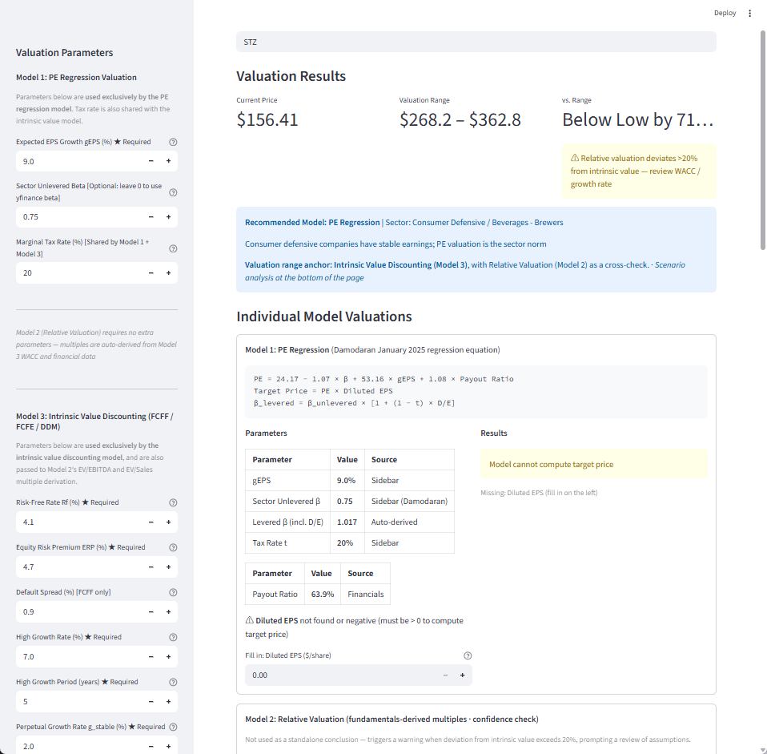

# US Equity Valuation Tool (Learning Edition)

**Input any US stock ticker → get a valuation range, key assumptions, scenario analysis, and data quality alerts.**

Works with any publicly listed US stock (e.g. AAPL, MSFT, GOOGL, ORCL). Data source: Yahoo Finance. Frontend: Streamlit.

> ⚠️ **Note**: yfinance reports an **undiluted** PE ratio, which is unreliable. This system computes its own **diluted PE**, consistent with platforms such as MOOMOO.

---

## Quick Start

```bash
pip install -r requirements.txt
streamlit run app.py          # open browser, enter any ticker
python examples/run_example.py          # CLI valuation for ORCL
python examples/run_example.py AAPL     # CLI valuation for AAPL
```

*For educational use only. Not investment advice.*

---

## Example Output (STZ — Constellation Brands)



---

## System Architecture (8-Layer Pipeline)

```
Ticker Input
    ↓ Layer 1  fetch.py / quality.py   — fetch raw data from Yahoo Finance; data quality report
    ↓ Layer 2  normalize.py            — compute FCF, net debt, margins
    ↓ Layer 3  selector.py             — enable models based on data availability; sector recommendation
    ↓ Layer 4  engine.py               — build valuation assumptions (discount rate, growth, etc.)
    ↓ Layer 5  registry.py             — run all three models in sequence
               multiples.py            — Model 2: relative valuation
               damodaran_iv.py         — Model 3: intrinsic value (FCFF / FCFE / DDM)
    ↓ Layer 7  weighting.py            — aggregate into final valuation range
    ↓ Layer 8  context.py              — generate tiered alerts
    ↓
  Final Report (JSON + Streamlit UI)
```

---

## Valuation Models

### Model 1 — PE Regression (Damodaran, January 2025)

**Principle:** Rather than picking a PE multiple subjectively, Damodaran regresses the PE ratios of thousands of US stocks against three fundamental drivers to find a statistically fitted equation.

**Formula:**
```
PE = 24.17 − 1.07 × β_levered + 53.16 × gEPS + 1.08 × Payout Ratio
Target Price = PE × Diluted EPS
β_levered = β_unlevered × [1 + (1 − t) × D/E]
```

**Interpretation of coefficients:**
| Variable | Coefficient | Meaning |
|---|---|---|
| β (levered) | −1.07 | Higher risk → lower multiple |
| gEPS | +53.16 | 1% more expected growth adds ~0.53× to PE |
| Payout Ratio | +1.08 | Higher dividends → modestly higher multiple |

**Best suited for:** Tech, Communication Services, Healthcare, Consumer Defensive, Financials — sectors where EPS growth is the primary valuation driver.

**Limitation:** Requires positive diluted EPS. For loss-making companies or those with very high debt, use Model 3 (FCFF).

---

### Model 2 — Relative Valuation (Fundamentals-Derived Multiples)

**Principle:** Damodaran's key insight — *any reasonable multiple is simply a compressed DCF*. Instead of anchoring on a subjective "12× industry average", this model derives the theoretically consistent multiple from the same assumptions used in Model 3 (WACC, g, reinvestment rate, tax rate).

**Formulas:**
```
EV/EBIT  = (1 − t) × (1 − RR) / (WACC − g)
EV/Sales = After-tax EBIT margin × (1 − RR) × (1 + g) / (WACC − g)

RR (Reinvestment Rate) = max(CapEx − D&A, 0) / NOPAT
NOPAT = EBIT × (1 − t)
```

**Role in the system:** Model 2 does **not** produce a standalone valuation conclusion. It serves as a **confidence cross-check** for Model 3:
- If EV/EBITDA or EV/Sales implied price deviates from Model 3 by >20%, the system triggers a divergence warning.
- Common cause: WACC assumption is too low/high, or the reinvestment rate is miscalibrated.

**Best suited for:** Capital-intensive industrials, consumer cyclicals, basic materials — where EBITDA is a more stable earnings proxy than EPS.

---

### Model 3 — Intrinsic Value Discounting (FCFF / FCFE / DDM)

This is the **primary valuation anchor**. The system automatically selects one of three sub-models based on the company's financial profile:

#### Sub-model selection logic

| Condition | Selected Model | Rationale |
|---|---|---|
| Payout ratio >70% **and** debt/market cap <50% | **DDM** | Mature cash cow; dividends are the most direct shareholder return |
| Net income ≤ 0 **or** debt/market cap >80% | **FCFF** | Loss-making or highly levered; FCFE is distorted by debt service |
| All other cases | **FCFE** | Stable leverage with positive earnings; FCFE directly measures equity cash flow |

#### FCFF (Free Cash Flow to Firm)

```
FCFF₀ = EBIT × (1 − t) − Net CapEx − ΔWorking Capital
Net CapEx = CapEx − D&A

WACC = re × E/(D+E) + rd × (1−t) × D/(D+E)
re   = Rf + β_levered × ERP
rd   = Rf + Default Spread

Terminal Value = FCFF_n × (1 + g_stable) / (WACC − g_stable)
Equity Value   = PV(FCFF high-growth) + PV(TV) − Total Debt + Cash
Value per Share = Equity Value / Diluted Shares
```

**Use when:** company is loss-making or heavily indebted (debt/market cap >80%). FCFF is the pre-debt cash flow, so it is unaffected by the debt structure.

#### FCFE (Free Cash Flow to Equity)

```
FCFE₀ = Net Income + D&A − CapEx − ΔWC + Net Debt Issuance

re  = Rf + β_levered × ERP
TV  = FCFE_n × (1 + g_stable) / (re − g_stable)
Value per Share = [PV(FCFE high-growth) + PV(TV)] / Diluted Shares
```

**Use when:** company has stable leverage and positive earnings. FCFE is the cash available directly to equity holders — conceptually cleaner than FCFF for normal companies.

#### DDM (Dividend Discount Model)

```
DPS₀ = Total Dividends Paid / Diluted Shares
       (or: Diluted EPS × Payout Ratio, if dividends paid is unavailable)

re  = Rf + β_levered × ERP
TV  = DPS_n × (1 + g_stable) / (re − g_stable)   [constraint: g_stable ≤ Rf]
Value per Share = Σ DPS_t / (1+re)^t  +  TV / (1+re)^n
```

**Use when:** company is a mature dividend payer with payout ratio >70% and low debt. For these companies, dividends are the most observable and reliable form of shareholder return.

#### Valuation range

The final range is anchored to Model 3's output:
```
Low  = Model 3 value × 0.85
High = Model 3 value × 1.15
```
If Model 3 is unavailable, Model 1 (PE) is used as the anchor. If neither is available, an equal-weight average is used.

---

## Parameters Reference

### Parameters the system fetches automatically (from Yahoo Finance)

| Parameter | Description |
|---|---|
| Current Price | Latest market price |
| Market Cap | Total market capitalization |
| Diluted Shares | Shares outstanding (diluted) |
| EBITDA | Earnings before interest, taxes, D&A |
| Revenue | Total revenue |
| Net Income | Bottom-line profit |
| EBIT (Operating Income) | Earnings before interest and taxes |
| CapEx | Capital expenditure |
| D&A | Depreciation & amortization |
| Total Debt | Total interest-bearing debt |
| Cash | Cash and equivalents |
| Beta (yfinance) | Regression beta (fallback; less accurate than sector beta) |
| Payout Ratio | Dividends / Net Income |
| Diluted EPS | Earnings per share (diluted) |
| Dividends Paid | Total cash dividends paid to shareholders |
| Net Debt Issuance | Net new borrowing (or net repayment) |

---

### Parameters you must estimate (sidebar inputs)

These parameters **cannot be read from historical data** — they reflect your forward-looking assumptions and market context. You must supply them.

#### Shared / Model 1

| Parameter | Label | Typical Range | How to Estimate |
|---|---|---|---|
| **gEPS** | Expected EPS Growth | 5%–20% | Sell-side consensus EPS growth estimates; or historical 3–5 year EPS CAGR. The single most important input for Model 1 (coefficient 53.16). |
| **Sector Unlevered Beta** | Sector β (unlevered) | 0.4–1.5 | From [Damodaran's beta table](https://pages.stern.nyu.edu/~adamodar/New_Home_Page/datafile/Betas.html) (updated January each year). Use the row matching the company's sector. Leave 0 to fall back to yfinance regression beta. |
| **Marginal Tax Rate** | Tax Rate | 21%–28% | US federal + state combined rate. A common default is 25%. Check the company's effective tax rate in recent 10-K filings if precision matters. |

#### Model 3 (Intrinsic Value)

| Parameter | Label | Typical Range | How to Estimate |
|---|---|---|---|
| **Rf** | Risk-Free Rate | 4%–5% | Use the current 10-year US Treasury yield (e.g. from FRED or Bloomberg). Check daily — it fluctuates. |
| **ERP** | Equity Risk Premium | 4%–5% | Damodaran updates the implied ERP monthly: [ERPbymonth.xlsx](https://pages.stern.nyu.edu/~adamodar/New_Home_Page/datafile/implprem/ERPbymonth.xlsx). For US stocks, ~4.2–4.5% is the current range. |
| **Default Spread** | Default Spread (FCFF only) | 0.8%–3.5% | Look up the company's credit rating → map to spread using Damodaran's [default spread table](https://pages.stern.nyu.edu/~adamodar/New_Home_Page/datafile/ratings.html). BBB ≈ 1.5–2.0%, A ≈ 0.8–1.2%, BB ≈ 2.5–3.5%. |
| **g_high** | High Growth Rate | 5%–20% | Your estimate of the company's FCF or DPS growth during the high-growth phase. Reference analyst consensus revenue/earnings growth. |
| **n_high** | High Growth Period | 3–10 years | How many years you expect the company to sustain above-average growth. Mature companies: 5 years. High-growth tech/biotech: 7–10 years. |
| **g_stable** | Perpetual Growth Rate | 2%–3% | Long-run nominal GDP growth. The system enforces g_stable ≤ Rf to prevent terminal value from exploding. 2.5% is a reasonable default for the US. |

---

## Data Fill-in (Inline Overrides)

If yfinance cannot retrieve a field (common for EBITDA, operating income, or EPS for certain companies), input boxes appear directly in each model card. Values entered there override the fetched data for that session.

| Fill-in Field | Unit | Notes |
|---|---|---|
| Payout Ratio | % | 0% for non-dividend-paying growth companies |
| Diluted EPS | $/share | From annual report; must be positive for Model 1 |
| EBITDA | $B | From income statement |
| Revenue | $B | From income statement |
| EBIT (Operating Income) | $B | From income statement |
| CapEx | $B | From cash flow statement (absolute value) |
| D&A | $B | From cash flow statement |
| Total Debt | $B | From balance sheet |
| Cash & Equivalents | $B | From balance sheet |
| Diluted Shares | B shares | From balance sheet or cover page of 10-K |
| Net Income | $B | From income statement |
| Total Dividends Paid | $B | From cash flow statement |
| Net Debt Issuance | $B | Positive = new borrowing, negative = repayment |

---

## Alerts and Warnings

| Alert | Trigger | Action |
|---|---|---|
| 🔴 Market cap inconsistency | Price × shares deviates from market cap by >5% | Check data source; yfinance may have stale info |
| 🟡 Stale financials | Latest financial date >6 months ago | Review whether more recent data is available |
| 🟡 High terminal value % | Terminal value >70% of total valuation | Sensitivity-check your g_stable and discount rate |
| 🟡 Relative vs. IV divergence | EV/EBITDA or EV/Sales price deviates from Model 3 by >20% | Review WACC or reinvestment rate assumptions |
| 🟡 Elevated D&A / Revenue | D&A / Revenue >15% | PE valuation may be distorted; prefer FCFF |
| 🟡 Low FCF / Net Income | FCF / Net Income <0.5 | Earnings quality concern; review cash conversion |

---

## Project Structure

```
module3/
├── app.py                          # Streamlit UI (8-layer pipeline entry)
├── src/valmod/
│   ├── types.py                    # Dataclass definitions for all pipeline layers
│   ├── pipeline.py                 # Main orchestrator: Layers 1–8
│   ├── data_layer/
│   │   ├── fetch.py                # Layer 1a: fetch raw data from Yahoo Finance
│   │   └── quality.py              # Layer 1b: data quality report
│   ├── normalization/
│   │   └── normalize.py            # Layer 2: compute FCF, net debt, margins
│   ├── classification/
│   │   └── selector.py             # Layer 3: model selection & sector recommendation
│   ├── assumptions/
│   │   └── engine.py               # Layer 4: build valuation assumptions
│   ├── models/
│   │   ├── registry.py             # Layer 5: run all models, handle failures
│   │   ├── multiples.py            # Model 2: EV/EBITDA, EV/Sales + Damodaran PE regression
│   │   └── damodaran_iv.py         # Model 3: FCFF / FCFE / DDM intrinsic value
│   ├── aggregation/
│   │   └── weighting.py            # Layer 7: aggregate into final range (±15%)
│   └── warnings/
│       └── context.py              # Layer 8: tiered alerts
├── config/
│   └── analyst_overrides.yaml      # Optional: override parameters without changing code
├── examples/
│   ├── run_example.py              # CLI: run valuation for any ticker
│   └── run_orcl.py                 # CLI: ORCL example
└── tests/
    ├── test.py
    └── test_smoke.py
```

---

## Valuation Range Calculation

The final range is anchored on the best available intrinsic model:

1. **Preferred anchor**: Model 3 intrinsic value (FCFF / FCFE / DDM)
2. **Fallback anchor**: Model 1 PE regression (if Model 3 fails)
3. **Last resort**: Equal-weight average of all available models

```
Low  = Anchor value × 0.85   (−15%)
High = Anchor value × 1.15   (+15%)
```

The ±15% band reflects **parameter uncertainty**, not cross-model disagreement. Cross-model divergence is surfaced separately as a divergence alert when any relative valuation result deviates from the anchor by more than 20%.
